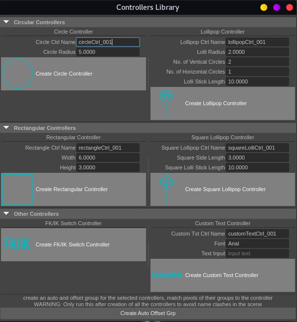
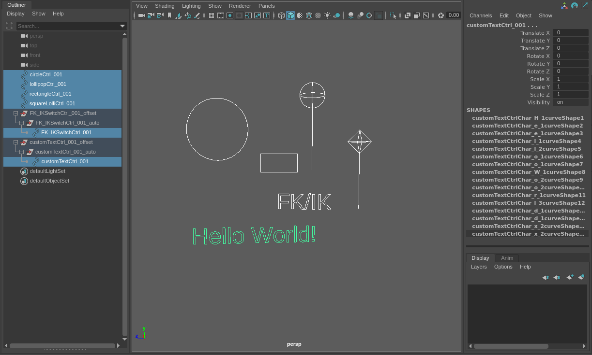

# Patrycja Poczkai Pipeline And TD Assignment
Repository for the Pipeline and TD assignment and code. 
# Rigging Controllers Creation Tool

## Description
*A Tool that allows to simplify and speed up the process of creating controllers for rigging, especially controllers created from multiple curves.*

### **The Problem**
Maya Riggers often need to create controllers for their rigs that can be easily grabbed by the animator from any angle, custom shaped controllers, controllers that are often used in almost every rig at least once like FK/IK Switches or multiples of the same controller. Manually creating all those controllers can be very time consuming as it often requires diving deeper into maya networks and parenting shapes under one translate node, using scripts plus a lot of manual adjustments. 
The goal of this project is to make the process of generating some typical rigging controllers more efficient, faster and to allow for quicker iterations and to an extent more procedural approach to creating controllers.

The idea comes mostly from my own experience and needs, as lot of people complain that my rigs have too many circle controllers that can be hard to grab from certain angles as that's what my controllers generating/constraining scripts generate as a default and I often prefer to focus on other aspects of the character setup than making the controllers perfect so I tend to abandon replacing my initial controllers or leave it till last minute. A Controller Library tool would allow me to provide animators with better rigs that are more user friendly without the need to spend a lot of time on generating complicated shapes manually or by writing custom scripts generating them every time.
Also some companies use similar tools. I know Frontier has their own Controller Library which is different to mine as it is more of a scroll through big library but ever since I saw it I wanted to have my own equivalent. 

### **Design**

#### **UI**

The idea was to create a UI window that allows the user to input values for a specific controller type and quickly create it. It was supposed to be quite illustrative and make it easy for the user to see what type of controller is getting created. The values provided by the user via the UI were then to be passed to controllers creation functions that get called by pressing specific UI buttons.

The icons make it easy to see what type of controller the user is creating.The float, int and text fields provide some default values that can be used as is or easily changed (the exception is the customm controller text input field that only gives an indication that text should be written there and without it provided maya will error).

Additionally to that, I decided to group controllers by their base shapes (circular controllers, rectangular controllers, other controllers) using collapsable panels for convenience and keeping things clean. Those panels are divided into separate sections for each controller which makes it clear to see what input does the certain controller require

The last button on the UI is the grouping button that allows the user to group a selected controller under auto and offset group and match groups pivots to the controllers. The double grouping comes from the way I rig but the function itself could be easily changed for a simpler grouping one if needed. Groups are useful to prevent the controllers themselves from having any transforms on them that would make animators job difficult as they would have to remember specific values in order to bring the character back to a certain starting pose.  

#### **Design of Controllers Themselves and their Functions**

***Currently the controllers you can create using the tool are as follows:***

- Circle Controller
  - takes in:
    - name - a string value
    - radius - a float
  - creates a simple circle controller
- Lollipop Controller
  - takes in:
    - name - a string value
    - radius - a float
    - number of vertical circles - int
    - number of horizontal circles - int
    - stick length - float
  - creates something resembling a lollipop, a sphere on a stick, can be used as an additional controller for broader movement or in places that are indented/concave and need a controller that sticks out far away from the body to make it easy to grab
- Rectangular Controller
  - takes in:
    - name - string
    - width - float
    - height - float
  - creates a simple rectangular controller (could be possibly used as a base for manual creation of more complex controllers)
- Square Lollipop Controller
  - takes in:
    - name - string
    - square side length - float
    - stick length - float
  - similar usage to the lollipop controller; square side length changes the size of the head
- FK/IK Switch Controller
  - does not take any user inputs
  - it has locked and hidden all (translation, rotation, scale) attributes despite visibility and an added FK/IK Switch attribute that is ready to have driven keys set on it
  - highly recommended to group the controller into an offset group that can be moved in the scene
- Custom Text Controller
  - takes in:
    - name - string
    - font -string
    - user text input - string
  - allows to create a custom controller, it is text based however if a symbol font like Windows' Webdings or Windings font is provided, it can provide interesting results and be used to generate interestingly shaped controllers like star, hand, eye or human shaped
  - should be even possible to use custom fonts provided given font is installed on the pc and can be accessed by maya
  - after creation the shape is no longer font dependent so the controller will show up on machines that don't have the font that was used for it's creation.

  *! Internally the function inputs are called a bit differently, for precise names check function definitions in [functions.py](scripts/functions.py).*

- Additionally you can also create auto offset group with pivots matching the controllers pivot.
  - this action requires a selection but can run on multiple controllers at once, 
  - it is recommended to run it after all the controllers were generated to avoid naming clashes as maya sees the scene as if there was no controller of that name before if one of the same name is inside of a group, 
  - also be careful to not to run it multiple times so on the controller then on it's group as it will group it multiple times (issue to be fixed in the future)

I initially planned to have box like and tube like controllers and many more 3-dimensional controllers that are easy to grab and could wrap around a character's limb nicely, but snapping curves to other curves or querying cvs proved to be more complex than expected so those controllers are not finalised, therefore not included in this version of the tool (to be implemented in future versions)

More controllers functions could be added in the fututre and code could be refactored for efficiency. 

## Summary of Bugs, Issues and Ideas for Future Development

 

### Known Bugs and Issues:
- lollipopCtrl horizontal circles generation gimbal lock like problem 
  - there is an odd and even numbers problem for odd numbers my old method same as one for vertical circles generation works but for even numbers it always generates one circle at 90 degrees that overlaps with a vertical circle and deleting that circle makes it crash when user inputs an even number, on the other hand the current method with the iterator works but it only generates in one quadrant between 0 and 90 when not reaching 90 or rather rotates not generates which just looks very skewed despite generating the correct number of circles the user requested unlike the deleting method that results in having one less circle than requested when an even number of circles is requested, the fix with multiplying every other circle by -1 works but the circles are still skewed so a different offset should be used to make it all visually perfect or different mathematical/programming solution has to be used
- better naming, making sure ints and float types are appropriately used
- add checking if something was already created like the mayaWindow or a certain controller offset group
- nice error checking and error messages could be added, maybe a popup window when there is no text input in the customTextCtrl also the UI of customTextCtrl could have a font preview so display the text in the font you chose
- it should be checked if all the freeze transforms etc are in the right places
- sticks for both types of lollipop controllers could be a boolean or a switch so it allows for more controllers variation and can be used or not (right now this can be cheated by using 0 length of the stick but even though it looks visually right it creates the stick shape object)
- try include grouping internally not as a separate thing maybe
- documentation and especially comments inside of the code could be improved

### Ideas for Future Development:
- more controllers(tube controller (problems with connecting 2 curves with another curve that snaps to both), box controller,rhombus/kite, triangle, various polygons,arrows that don't come from a font and/or include a custom font  in the module, SVG based controllers implemented in similar way as customTextCtrl, facial rig typical controllers)
- more intuitive and concise UI, maybe redo the UI in Qt instead of maya.cmds
  - consider sliders and interactive viewport for creation preview (if possible and necessary)
- colour options (drawing overrides) to colour controllers in the viewport and outliner eg. all controllers on the left green, right red, middle yellow etc or possibility to choose colours by user
- possible merge with my constraining to joints script here ([joints.py](https://github.com/patipocz/DinoRigScripts/blob/ffbbfb215da40c51597c423c3ea4439c1486ed4e/joints.py))
  - ability to generate a few controllers in a row on a joint chain when they get gradually smaller/bigger by a certain value to better wrap around a limb (would be especially useful for arms and fingers, but generally useful for all limbs)
- reconsider the auto offset grouping function (it comes from the way I persnally rig (as learned from Jay Amin's rigging tutorials) and I prefer to just create those groups for everything and use as needed but everyone structures things their own ways so it could be made more inclusive) also there might be a way to rather use something with Parent Offset Matrix
  - can be changed to choose if you want to match pivot or not 
- installation script could be added, the module structure could be reworked

## Tests
I mostly tested as I went using visual comparison and by printing values using print statements. The visual comparison of the scenes and UI involved reloading the scripts and often closing maya and reopening or ensuring I cleaned up what I previously did or on the contrary generating multiple controllers and seeing if they break at some point (as some were randomly getting stuck on one weird size for example because of some cache issues or similar) and comparing the generation using the UI with the generation using just calling the function like in [testScript.py](/tests/testScript.py). 
For testing the modular setup it involved some structural changes in the folders.

Some tests for the functions can be found in [tests](/tests/) folder. 

Sometimes I also just took pieces of code and run it in separate files or Maya Script Editor tabs to test if methods work. Examples of such files can be found in ControllersLibrary folder. like [the broken not working rectangles that turned out to be a cache issue mostly ](/ControllersLibrary/brokenSquares.py) or the gimbal lock/horizontal circles generation and rotation problem workarounds[lollipopGimbalProblem](/ControllersLibrary/lollipopGimbalProblem.py) [gimbalLockIssueWorkaround](/ControllersLibrary/gimbalLockIssueWorkaround.py)

## Installation Instructions

[Instructions for loading the tool to maya can be found here](docs/USERINSTRUCTION.md)